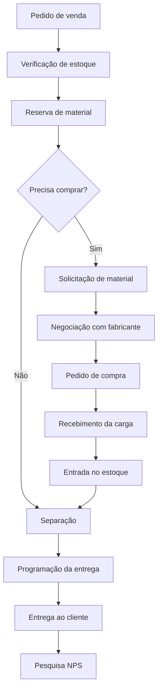

<div align="center">

# MZT - Core

**Sistema integrado de operações**

Controle operacional, logístico e de estoque, do pedido de venda à entrega ao cliente.


</div>

---

## Sumário

- [Sobre o projeto](#sobre-o-projeto)
- [Objetivo](#objetivo)
- [Funcionalidades previstas](#funcionalidades-previstas)
- [Fluxo geral](#fluxo-geral)
- [Banco de dados](#banco-de-dados)
  - [Módulos](#módulos)
  - [Views](#views)
- [Estrutura do projeto](#estrutura-do-projeto)
- [Tecnologias](#tecnologias)
- [Status do projeto](#status-do-projeto)
- [Roadmap](#roadmap)
- [Observações](#observações)

---

## Sobre o projeto

O **MZT - Core** é um sistema interno voltado ao controle operacional, logístico e de estoque empresarial

Foi pensado para centralizar e organizar processos de **estoque, expedição, recebimento, pedidos, compras, entregas, transportadoras, inventário, indicadores e satisfação do cliente**.

A proposta é que ele funcione como o **núcleo operacional** da empresa, complementando o ERP comercial já utilizado.

## Objetivo

Criar uma plataforma capaz de acompanhar o fluxo operacional **desde a necessidade de material até a entrega ao cliente**, mantendo histórico, rastreabilidade e informações para relatórios e dashboards.

## Funcionalidades previstas

### Cadastros

- [ ] Clientes
- [ ] Vendedores
- [ ] Produtos
- [ ] Fabricantes
- [ ] Transportadoras e motoristas

### Estoque

- [ ] Controle de lotes de produtos
- [ ] Controle de estoque físico
- [ ] Controle de estoque por local
- [ ] Classificação de estoque
- [ ] Reserva de estoque para clientes
- [ ] Movimentações de estoque
- [ ] Inventário de estoque
- [ ] Controle de divergências de inventário

### Pedidos

- [ ] Controle de pedidos de venda
- [ ] Histórico de status dos pedidos
- [ ] Alterações de prazo de entrega
- [ ] Solicitações de entrega parcial
- [ ] Separação de pedidos

### Compras e recebimento

- [ ] Solicitações de material
- [ ] Negociação com promotores de fabricantes
- [ ] Pedidos de compra
- [ ] Recebimento de cargas

### Logística

- [ ] Controle de fretes
- [ ] Programação e acompanhamento de entregas

### Indicadores e satisfação

- [ ] Indicadores operacionais e logísticos
- [ ] Relatórios gerenciais
- [ ] NPS e satisfação do cliente
- [ ] Feedback por pedido e vendedor
- [ ] Dashboards operacionais e gerenciais

## Fluxo geral



<details>
<summary>Versão em texto</summary>

```text
Pedido de venda
    ↓
Verificação de estoque
    ↓
Reserva de material
    ↓
Necessidade de compra, se houver
    ↓
Solicitação de material
    ↓
Negociação com fabricante
    ↓
Pedido de compra
    ↓
Recebimento da carga
    ↓
Entrada no estoque
    ↓
Separação
    ↓
Programação da entrega
    ↓
Entrega ao cliente
    ↓
Pesquisa NPS
```

</details>

## Banco de dados

O MZT - Core utiliza **PostgreSQL** como banco de dados principal.

A estrutura está sendo organizada em módulos para facilitar manutenção, escalabilidade e evolução futura.

### Módulos

| Módulo | Descrição |
|---|---|
| Core / cadastros | Clientes, vendedores, fabricantes, transportadoras e motoristas |
| Produtos e lotes | Produtos e controle de lotes |
| Pedidos | Pedidos de venda e histórico de status |
| Estoque e inventário | Estoque, reservas, movimentações e inventário |
| Compras | Solicitações de material e pedidos de compra |
| Recebimento | Recebimento de cargas e entrada no estoque |
| Logística de entrega | Fretes, programação e acompanhamento de entregas |
| NPS | Pesquisa de satisfação por pedido e vendedor |
| Views gerenciais | Consolidação de dados para relatórios e dashboards |
| Checks de validação | Verificações de integridade dos dados |

### Views

As views consolidam informações usadas em relatórios, dashboards e telas operacionais. Atualmente estão previstas ou criadas:

| View | Finalidade |
|---|---|
| Estoque disponível | Saldo disponível para venda |
| Controle de prazo dos pedidos | Acompanhamento de prazos de entrega |
| Divergências de inventário | Diferenças entre contagem e sistema |
| Fretes mensais | Custos de frete por mês |
| NPS por vendedor | Satisfação do cliente por vendedor |

## Estrutura do projeto

```text
MZT-Core/
│
├── database/
│   ├── scripts/
│   ├── views/
│   ├── checks/
│   ├── seeds/
│   └── backups/
│
├── backend/
├── docs/
├── tests/
│
├── .env
├── .gitignore
├── README.md
└── requirements.txt
```

| Pasta / arquivo | Conteúdo |
|---|---|
| `database/scripts/` | Scripts de criação das estruturas do banco |
| `database/views/` | Views gerenciais |
| `database/checks/` | Checks de validação |
| `database/seeds/` | Dados de teste |
| `database/backups/` | Backups do banco |
| `backend/` | Aplicação Django |
| `docs/` | Documentação |
| `tests/` | Testes |
| `.env` | Variáveis de ambiente (não versionar) |
| `requirements.txt` | Dependências Python |

## Tecnologias

### Em uso

| Camada | Tecnologia |
|---|---|
| Banco de dados | PostgreSQL, SQL |
| Backend | Python, Django |

### Planejadas

- API REST
- Dashboards
- Integrações com sistemas externos
- Integrações com ERP
- Automação de envio de pesquisas NPS
- Relatórios automatizados

## Status do projeto

Atualmente o MZT - Core está na fase de **modelagem e implementação do banco de dados**.

| Módulo | Status |
|---|---|
| Cadastros principais | ✅ Estruturado |
| Produtos e lotes | ✅ Estruturado |
| Pedidos | ✅ Estruturado |
| Estoque | ✅ Estruturado |
| Reservas | ✅ Estruturado |
| Movimentações | ✅ Estruturado |
| Inventário | ✅ Estruturado |
| Compras | ✅ Estruturado |
| Recebimento | ✅ Estruturado |
| Entregas | ✅ Estruturado |
| NPS | ✅ Estruturado |
| Views gerenciais | ✅ Estruturado |
| Checks de validação | ✅ Estruturado |
| Backend Django | ⏳ Após consolidação do banco |

## Roadmap

### Banco de dados

- [ ] Criação de índices
- [ ] Criação de triggers e funções
- [ ] Ajustes de integridade e performance
- [ ] Inserção de dados de teste

### Backend e interface

- [ ] Desenvolvimento do backend
- [ ] Autenticação e controle de usuários
- [ ] Desenvolvimento das telas operacionais
- [ ] Dashboards

### Automações

- [ ] Automação de alertas
- [ ] Automação da pesquisa NPS

## Observações

> O MZT - Core está sendo desenvolvido de forma **modular**, para permitir crescimento gradual e futuras integrações com outros sistemas utilizados pela empresa.


## Autor

<div align="center">

**Leonardo Mouzart do Nascimento**

Ciência de Dados

[](https://github.com/LeoMouzart)

</div>
